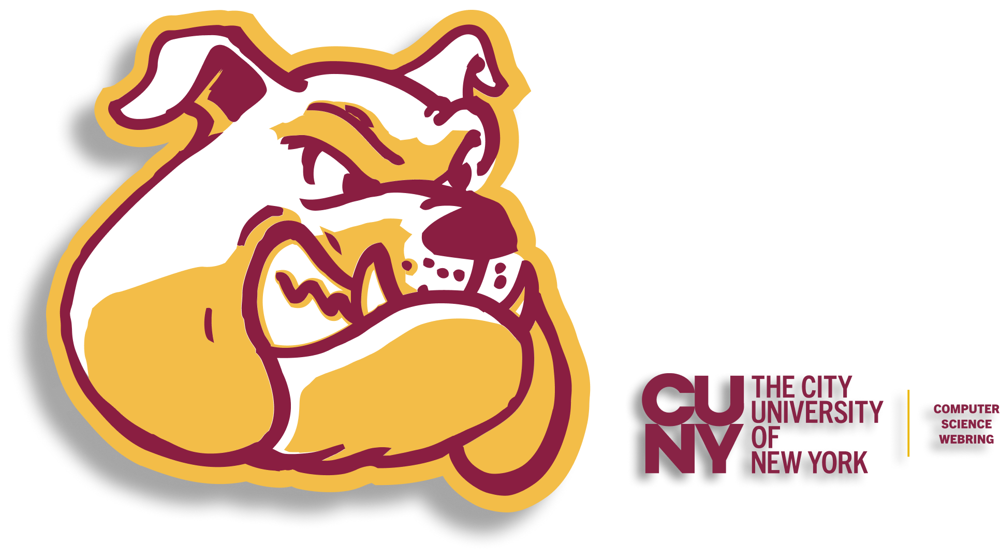

<p align="center">
	
</p>

<p align="center">
  <a href="#what-is-this?"><strong>Purpose</strong></a> &middot;
  <a href="https://github.com/jraculea/cunyring"><strong>GitHub</strong></a> &middot;
  <a href="https://cunyring.com"><strong>Website</strong></a>
</p>

<p align="center">
  <a href="https://github.com/jraculea/cunyring/blob/main/LICENSE"></a>
  <a href="https://github.com/jraculea/cunyring/stargazers"></a>
  <a href="https://img.shields.io/github/languages/code-size/jraculea/cunyring"></a>
  <a href="https://github.com/jraculea/cunyring/actions/workflows/build.yml/badge.svg"></a>
  <a href="https://github.com/jraculea/cunyring/actions/workflows/validate-member.yml/badge.svg"></a>
</p>

<br/>

<p align="center">
	A student-built
	<a href="https://en.wikipedia.org/wiki/Webring" target="_blank" rel="noopener noreferrer">
		webring
	</a>
	connecting personal websites, portfolios, and projects from CUNY students and alumni in Computer Science and related fields.
</p>

<br/>

# What is this?

We're bringing back a **90s-00s web concept** to strengthen tech communities across CUNY campuses and give students the spotlight they deserve.

- **How it works:** Every site in the webring features a **navigation widget** that routes visitors between our personal websites, portfolios, or blogs.
- **The impact:** By linking our spaces together, we create a network that drives curiosity and creativity while **boosting the search engine visibility** of students who join.

<br/>

## How do I join?

To join, you must be an enrolled student or alum at one of the 26 CUNY colleges, and majoring or have majored in Computer Science or a related field.

### 1. Add the Navigation Widget

The functionality of the webring relies on the widgets. You have to include it somewhere *(preferably visible)* on your site. We recommend adding it to your footer layout. Copy the snippet from the **[Widget Template](#widget-template)** section below, paste it into your HTML or JSX components, and replace the placeholder with your domain name.

### 2. Add your details

Fork this repository and create a new `.json` file inside the `/members/` directory, called `your-name.json`. Append something to make the file name unique if your name is already taken (e.g., `john-doe.json` --> `john-doe-bc.json`). Edit the object below to include your details:

```json
{
    "name": "Your Name",
    "year": "2030",
    "school": "Brooklyn College",
    "site": "https://yoursite.com"
}
```

**Notes:**
- Use the official spelling of your college (e.g., *Baruch College*, *The City College of New York*) so everything maps correctly.
- The scheme/protocol (`https://`) of your site is not necessary (i.e., `"yoursite.com"` is valid).

### 3. Submit a Pull Request

- Open a Pull Request against the main branch. We'll try to review it as fast as possible!

*As long as you're a CUNY student/alum, your information is valid, and your site contains no innappropriate content, you're good to go!*

<br/>

## Widget Template

```html

```

*Feel free to customize the widget any way you wish!*

#### HTML (using Tailwind CSS):

```html
<!-- Replace `your-site-here` with your site (e.g., johndoe.com) -->
<div class="flex items-center gap-2">
    <a href="https://cunyring.com/?action=prev&from=your-site-here">←</a>
    <a href="https://cunyring.com/" target="_blank">  
        
	</a>
	<a href="https://cunyring.com/?action=next&from=your-site-here">→</a>
</div>
```

#### JSX (using Tailwind CSS):

```jsx
// Replace `your-site-here` with your site (e.g., johndoe.com)
<div className="flex items-center gap-2">
    <a href="https://cunyring.com/?action=prev&from=your-site-here">←</a>
    <a href="https://cunyring.com/" target="_blank">
        
    </a>
    <a href="https://cunyring.com/?action=next&from=your-site-here">→</a>
</div>
```

#### Some Alternative Widgets:

| Preview | Code |
|:---:|:---|
|  | `` |
|  | `` |
|  | `` |
|  | `` |
|  | `` |

<br/>

## Credits

Thanks to everyone who joins!

### Inspirations

- **[Waterloo CS Webring](https://github.com/JusGu/uwatering):** Inspired the documentation layout and widget architecture.
- **[Waterloo SE Webring](https://github.com/simcard0000/se-webring):** Heavily inspired the page layout and design.

<br/>

---

<br/>

<p align="center">
	
</p>
